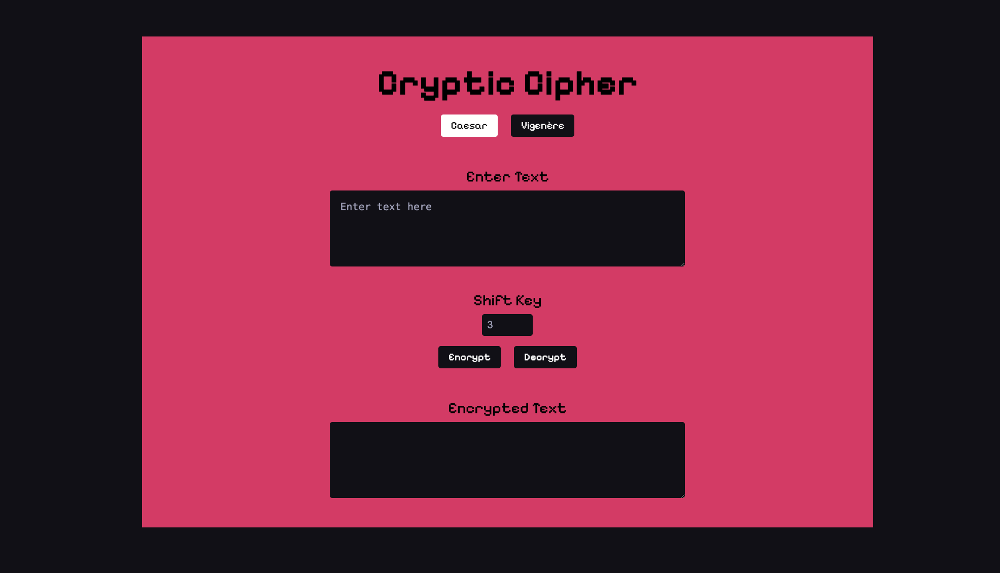

# Cryptic Cipher

Cryptic Cipher is a user-friendly website designed for encryption and decryption using classic cipher methods: Caesar
Cipher and Vigenère Cipher. It provides a sleek interface built with HTML, CSS, and JavaScript, enabling users to
encrypt and decrypt text easily.

## Features

- Caesar Cipher Encryption/Decryption: Utilize a shift number to encrypt or decrypt your text, shifting each letter by
  the specified number of places down the alphabet.
- Vigenère Cipher Encryption/Decryption: Encrypt or decrypt text using a word key, where each letter's shift is
  determined by the corresponding letter in the keyword.
- Responsive Design: The website is mobile-responsive, ensuring a seamless experience on devices of various sizes.

## About the Ciphers

- Caesar Cipher: A substitution cipher where each letter in the plaintext is shifted a certain number of places down or
  up the alphabet.
- Vigenère Cipher: A method of encrypting alphabetic text by using a keyword to determine the shift for each letter in
  the plaintext.

## How does it work?

### Encrypting Text

- Choose between Caesar Cipher and Vigenère Cipher by clicking the respective button.
- Enter the text you want to encrypt in the text area.
  For Caesar Cipher, input the shift number. For Vigenère Cipher, enter the keyword.
- Click the "Encrypt" button to get the encrypted text, which will appear in the output area.

### Decrypting Text

- Follow steps 1-4 as described in the Encrypting Text section.
  Click the "Decrypt" button to see the decrypted text in the output area.